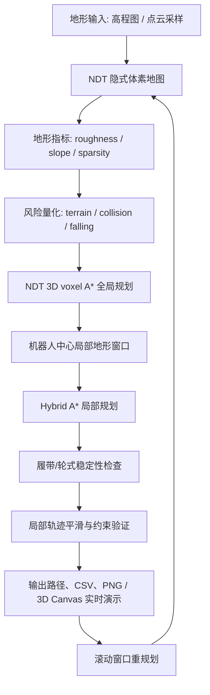

# 论文主流程说明

本文档面向下游使用者，说明本仓库复刻的论文主线流程是什么、各部分如何衔接、应该运行哪些入口，以及后续扩展时应遵守哪些接口边界。

目标论文：

```text
Real-Time Multilevel Terrain-Aware Path Planning for Ground Mobile Robots in Large-Scale Rough Terrains
```

本仓库不复刻 ROS 工具链，也不运行对比方法、消融实验或额外 benchmark。当前主线只覆盖论文核心链路：

```text
地形输入
  -> NDT/implicit voxel map
  -> 地形可通行性量化
  -> NDT 全局规划
  -> 局部窗口裁剪
  -> Hybrid A* 局部规划
  -> 几何稳定性检查
  -> 滚动重规划
  -> 场景级验证与交互式实时演示
```

## 1. 论文主线在解决什么问题

论文要解决的是大尺度崎岖地形中的地面机器人路径规划问题。普通二维最短路只能判断平面障碍，而崎岖地形还需要判断：

- 坡度是否过大
- 地表是否粗糙
- 点云/地图是否稀疏或不确定
- 机器人是否会碰撞
- 是否存在坠落、沟壑、台阶风险
- 局部轨迹是否满足机器人运动和稳定性约束

因此，主线不是直接在地图上找最短路径，而是先把地形转换成可通行性代价，再用多层规划结构生成路径：

- 全局层负责在大范围内找到低风险路线。
- 局部层负责在机器人附近生成更细、更可执行的轨迹。
- 重规划层负责在地图变化或机器人前进后不断刷新路径。

## 2. 主流程总览



## 3. 各阶段说明

### 3.1 地形输入

当前主线 demo 使用合成地形场景作为输入，包括 stairs、rubble、grass、hill、bridge、field。每个场景包含：

- height：二维高程网格
- obstacle：障碍物 mask
- resolution：栅格分辨率
- origin：地图原点
- start / goal：起终点

主要代码：

- `src/traversability/paper_scenario_suite.py`
- `src/traversability/paper_pipeline_demo.py`

下游如果要替换成真实数据，应该优先把数据转换成相同语义：

```text
height grid + obstacle mask + resolution + origin + start/goal
```

不建议直接改规划器内部逻辑来适配数据格式。

### 3.2 NDT 隐式体素地图

地形点会被组织成 NDT 风格的稀疏体素地图。每个体素维护：

- 点数 count
- 均值 mean
- 协方差 covariance
- 法向 normal
- roughness
- slope
- sparsity
- traversal cost

主要代码：

- `src/traversability/ndt_map.py`

这一层的作用是把原始地形转换成可查询的空间结构。全局规划器和局部规划器都依赖它提供的可通行性信息。

### 3.3 地形可通行性量化

每个体素会被评估为不同风险项：

- terrain risk：来自坡度、粗糙度、地形复杂度
- collision risk：来自障碍物和机器人几何占用
- falling risk：来自沟壑、边缘、支撑不足区域

最终得到一个 traversal cost。规划器会倾向于避开高 cost 区域，而不是只追求几何最短距离。

下游使用时应把 traversal cost 理解为主线中的核心中间量：

```text
terrain metrics -> traversal cost -> planner edge/node cost
```

### 3.4 NDT 全局规划

全局规划在 NDT 体素图上运行 3D voxel A*。它的目标是找到一条大范围、低风险、连通可行的路线。

主要代码：

- `src/traversability/ndt_planner.py`

全局规划器使用的代价结构可以简化理解为：

```text
edge cost = path length cost + traversal cost
```

此外，代码中维护了 connected traversable voxel set，用于把搜索限制在可通行连通体中，减少无效搜索。

输出是全局路径：

```text
global_path: list[(x, y, z)]
```

它不是最终控制轨迹，而是局部规划的引导线。

### 3.5 局部窗口裁剪

论文主线采用全局-局部结构。局部规划不需要每次处理整张大地图，而是在机器人附近裁剪一个局部窗口。

主要代码：

- `src/traversability/paper_pipeline_demo.py`
- `src/traversability/paper_receding_demo.py`
- `src/traversability/terrain.py`

局部窗口负责提供更高频、更贴近机器人当前位置的地形查询。这样可以把大范围规划和局部可执行轨迹生成拆开。

### 3.6 Hybrid A* 局部规划

局部规划使用 Hybrid A*。与普通栅格 A* 不同，Hybrid A* 的节点包含机器人姿态：

```text
(x, y, yaw)
```

它会考虑：

- 机器人朝向
- 运动 primitive
- 转向约束
- 局部障碍
- 全局路径 heuristic 引导
- NDT 可通行体素约束
- 稳定性过滤

主要代码：

- `src/traversability/hybrid_local_planner.py`

输出是局部可执行轨迹：

```text
local_path: list[(x, y, yaw)]
```

### 3.7 稳定性检查

局部路径不能只满足几何避障，还要满足机器人通过崎岖地形时的稳定性。

当前实现包含两类稳定性模型：

- 履带机器人稳定性：`src/traversability/tracked_stability.py`
- 轮式机器人稳定性：`src/traversability/wheeled_stability.py`

履带模型主要检查：

- 主履带/摆臂 checkpoint 接触
- 支撑多边形
- CoM/ZMP 是否落在支撑区域内
- body collision
- NDT 法向对局部支撑面的初始化

局部规划过程中，不稳定节点会被过滤。路径平滑时也会重新检查风险和稳定性，避免平滑后穿过不可通行区域。

### 3.8 滚动重规划

真实机器人运行时，地图会不断更新，机器人也会不断前进，所以主线包含 receding-horizon 重规划：

```text
构建/更新 NDT 地图
  -> 全局规划
  -> 局部规划
  -> 执行一小段
  -> 注入或感知新的地图变化
  -> 重新规划
```

主要代码：

- `src/traversability/paper_receding_demo.py`

该 demo 会运行多个规划周期，并在中途加入障碍变化，用于验证主线是否能重新规划。

## 4. 下游应该运行哪些入口

### 4.1 主线完整验证

只运行论文主线，不运行对比方法、消融实验或 benchmark：

```powershell
.venv\Scripts\python.exe -m traversability.verify_paper_mainline
```

该入口会依次验证：

- NDT map
- NDT global planner
- tracked stability
- wheeled stability
- Hybrid local planner
- paper pipeline
- paper receding pipeline
- paper scenario suite

### 4.2 全局规划到局部规划 demo

```powershell
.venv\Scripts\python.exe -m traversability.paper_pipeline_demo --output runs\paper_pipeline
```

主要输出：

- `runs/paper_pipeline/paper_pipeline_summary.csv`
- `runs/paper_pipeline/paper_pipeline_global_path.csv`
- `runs/paper_pipeline/paper_pipeline_local_path.csv`
- `runs/paper_pipeline/paper_pipeline.png`

这个 demo 用于理解：

```text
NDT global path -> Hybrid local path
```

### 4.3 滚动重规划 demo

```powershell
.venv\Scripts\python.exe -m traversability.paper_receding_demo --output runs\paper_receding
```

主要输出：

- `runs/paper_receding/paper_receding_summary.csv`
- `runs/paper_receding/paper_receding_trajectory.csv`
- `runs/paper_receding/paper_receding.png`

这个 demo 用于理解：

```text
plan -> execute short segment -> map update -> replan
```

### 4.4 论文场景 suite

```powershell
.venv\Scripts\python.exe -m traversability.paper_scenario_suite --output runs\paper_scenarios
```

主要输出：

- `runs/paper_scenarios/paper_scenarios.csv`
- `runs/paper_scenarios/paper_scenarios_summary.csv`
- `runs/paper_scenarios/stairs.png`
- `runs/paper_scenarios/rubble.png`
- `runs/paper_scenarios/grass.png`
- `runs/paper_scenarios/hill.png`
- `runs/paper_scenarios/bridge.png`
- `runs/paper_scenarios/field.png`

这个 demo 用于比较不同地形主题下的路径结果和风险指标。

### 4.5 交互式实时主线演示

```powershell
.venv\Scripts\python.exe -m traversability.paper_interactive_demo
```

浏览器会打开一个实时 3D Canvas 工作台。该入口仍然运行同一条论文主线计算链路：

- 高程图/预设地形采样成 3D 点云
- NDT implicit voxel map，按体素维护 count、mean、covariance、normal
- roughness / slope / sparsity 指标与 terrain / collision / falling traversal cost
- NDT 3D voxel A* 全局规划，输出 `globalPath3d`
- 机器人中心局部窗口裁剪
- Hybrid A* 局部规划，输出贴地 `localPath3d`
- tracked stability 节点过滤
- plan -> execute short segment -> map update -> replan

界面支持：

- 切换 `pipeline / stairs / rubble / grass / hill / bridge / field` 预设地图
- 点击移动 start / goal
- 点击注入动态障碍
- 一键注入论文 rolling replanning demo 中的地图更新
- 调整局部窗口半径和每周期执行距离
- 单步执行或自动滚动重规划
- 单独开关点云派生地形、临时高程图、点云、NDT 体素、概率椭圆、法向、路径、局部窗口和坐标网格
- 点击底部主流程阶段条，按阶段聚焦对应图层和关键说明
- 实时查看 point cloud samples、occupied/traversable voxels、octree leaves/nodes、runtime、expanded nodes、稳定性和风险指标

启动参数：

```powershell
# 默认 http://127.0.0.1:8765/
.venv\Scripts\python.exe -m traversability.paper_interactive_demo

# 端口被占用时改用其他端口
.venv\Scripts\python.exe -m traversability.paper_interactive_demo --port 8767

# 只启动服务，不自动打开浏览器
.venv\Scripts\python.exe -m traversability.paper_interactive_demo --no-browser

# 开发唯一前端入口 frontend/paper-workbench/index.html 时启用源码热更新轮询
.venv\Scripts\python.exe -m traversability.paper_interactive_demo --dev

# CI/自动验证中只跑一个规划周期并输出 JSON 摘要
.venv\Scripts\python.exe -m traversability.paper_interactive_demo --once
```

#### 可视化使用说明

1. 启动入口后打开浏览器页面，默认地址是 `http://127.0.0.1:8765/`。
2. 在 `预设地图` 中切换典型地形。每个预设会重置起终点，并重新运行同一条 NDT global + Hybrid local 主线。
3. 点击 `规划`：在当前地形、起点、终点和动态障碍上运行一次完整主线。
4. 点击 `前进一步`：执行局部轨迹上的一小段，然后以新的机器人位置重新规划。
5. 点击 `自动`：循环执行“规划 -> 前进一步 -> 重规划”，再次点击可停止。
6. 在 `路径与地形编辑` 区选择 `起点`、`终点` 或 `地形`，再单击地形即可修改对应对象。按住 `Shift` 单击会放大笔刷。
7. 点击 `论文中途更新`：注入与 rolling replanning demo 对齐的中途地图变化，用于观察主线如何绕开新障碍。
8. 使用 `每步执行距离` 调整每个重规划周期执行多远，使用 `局部窗口半径` 调整 Hybrid A* 处理的机器人中心局部地图范围。
9. 使用 `等轴`、`俯视`、`侧视` 和 `适配` 切换或重置视角。画布使用正交 yaw/pitch 相机，拖拽只改变方位角和俯仰角，不允许 roll，也不暴露额外的镜头倾斜/高度夸张参数。
10. 使用 `图层` 开关确认每个流程中间量：点云派生地形、临时高程图、点云、NDT 体素、概率椭圆、法向、全局路径、局部路径和局部窗口。临时高程图由当前局部点云窗口反推得到，对应论文中接触点识别/稳定性估计时的临时 elevation map。
11. 点击底部阶段条或右侧 `主流程单步分解`，可聚焦查看点云输入、NDT 建图、风险量化、全局规划、局部规划、稳定性过滤或滚动重规划。

画布中各元素含义：

- 等轴 3D 地形表面：默认显示点云派生地形，颜色表示高程，红色区域表示障碍或高风险地形。
- 临时高程图：从机器人中心局部点云窗口反推的 2.5D 查询结构，用于对照稳定性估计里的接触高度查询；它不是仿真原始高程图。
- 白色点：当前地形采样得到的 3D point cloud。
- 半透明小方块：NDT implicit voxel map 的体素中心，颜色表示 traversal cost / risk。
- 青色短线：由邻域 Gaussian 融合和协方差 SVD 得到的地形法向，展示隐式建图如何给局部稳定性初始化支撑面。
- 黄色虚线：NDT 3D voxel A* 全局路径。
- 蓝色实线：Hybrid A* 局部可执行轨迹，按地形高度贴地显示。
- 紫色虚线框：当前机器人中心局部规划窗口。
- 绿色实线：已经执行过的滚动轨迹。
- 绿色圆点 / 红色圆点：起点和终点。

右侧 `规划指标`、`体素与可通行性` 和 `主流程单步分解` 面板会随每次规划刷新，用来确认点云输入、NDT 建图、风险量化、全局规划、局部规划、稳定性过滤和滚动重规划是否成功。

如果只想在自动验证里确认交互式主线仍可计算，不启动浏览器：

```powershell
.venv\Scripts\python.exe -m traversability.verify_paper_interactive
```

## 5. 下游如何接入自己的数据

推荐接入路径：

1. 准备点云输入。真实系统应接入 LiDAR/SLAM 输出的去畸变点云和位姿；仿真 demo 中的高程图只用于生成参考点云：

```text
points: np.ndarray  # Nx3 xyz point cloud
start: tuple[float, float, float]
goal: tuple[float, float, float]
```

2. 仿真场景才执行高程图到点云采样：

```text
sample_points(height, obstacle, resolution, origin)
```

3. 构建 NDT map：

```text
NDTImplicitMap(points, ndt_config(resolution))
```

4. 运行全局规划：

```text
plan_ndt_global(ndt_map, start, goal)
```

5. 从点云派生局部高分辨率地图，再运行 Hybrid A*。原始高程图不进入局部规划或稳定性估计：

```text
crop_pointcloud_local_window(points, resolution, center_xy, radius)
plan_hybrid_local(...)
```

6. 输出 CSV/PNG 或接入自己的控制/仿真模块。

建议优先参考：

- `src/traversability/paper_pipeline_demo.py`
- `src/traversability/paper_scenario_suite.py`

这两个文件是最清晰的主线调用样例。

## 6. 当前主线边界

当前主线包含：

- NDT 地图
- 地形指标计算
- traversal cost
- NDT 全局规划
- Hybrid A* 局部规划
- 履带/轮式稳定性检查
- 滚动重规划
- 论文主题场景验证
- CSV/PNG 可视化输出
- 浏览器 3D Canvas 交互式实时演示

当前主线不包含：

- ROS 节点、launch、bag 回放
- 官方代码复刻
- 对比方法
- 消融实验
- 多种 baseline
- 大规模 benchmark 聚合
- 真实机器人控制器
- 电机/执行器级动力学限制

如果下游只想复用论文主线，不应调用：

- `traversability.ablation_demo`
- `traversability.benchmark_suite`
- `traversability.verify_reproduction --check-ablation`
- `traversability.verify_reproduction --check-benchmark`

## 7. 快速理解代码结构

```text
src/traversability/ndt_map.py
  NDT 隐式体素地图、SVD 地形指标、风险量化

src/traversability/ndt_planner.py
  NDT traversability map 上的 3D voxel A* 全局规划

src/traversability/hybrid_local_planner.py
  Hybrid A* 局部规划、局部路径平滑、全局路径引导

src/traversability/tracked_stability.py
  履带机器人几何稳定性检查

src/traversability/wheeled_stability.py
  轮式机器人几何稳定性检查

src/traversability/paper_pipeline_demo.py
  论文主线集成样例：NDT global -> Hybrid local

src/traversability/paper_receding_demo.py
  论文主线滚动重规划样例

src/traversability/paper_scenario_suite.py
  论文主题地形场景 suite

src/traversability/paper_interactive_demo.py
  论文主线交互式实时演示：预设地图、规划 API 和标准库 HTTP 服务

src/traversability/paper_visualization_frontend.py
frontend/paper-workbench/index.html
  交互主线 3D Canvas 工作台前端：渲染队列、阶段聚焦、拾取编辑和指标面板

src/traversability/verify_paper_mainline.py
  只运行论文主线验证的入口
```

## 8. 推荐给下游的最小使用路径

如果下游只想确认主线可用：

```powershell
cd D:\Code\robot
.venv\Scripts\python.exe -m traversability.verify_paper_mainline
```

如果下游想看单个完整流程：

```powershell
.venv\Scripts\python.exe -m traversability.paper_pipeline_demo --output runs\paper_pipeline
start runs\paper_pipeline\paper_pipeline.png
```

如果下游想看在线重规划过程：

```powershell
.venv\Scripts\python.exe -m traversability.paper_receding_demo --output runs\paper_receding
start runs\paper_receding\paper_receding.png
```

如果下游想实时交互地看主线如何响应 start / goal / 障碍更新：

```powershell
.venv\Scripts\python.exe -m traversability.paper_interactive_demo
```

如果下游想看不同地形的差异：

```powershell
.venv\Scripts\python.exe -m traversability.paper_scenario_suite --output runs\paper_scenarios
start runs\paper_scenarios\field.png
start runs\paper_scenarios\paper_scenarios.csv
```

## 9. 判断主线是否正常的标准

主线正常时，`verify_paper_mainline` 最后一行应为：

```text
paper mainline verification passed
```

场景 suite 中每个场景应满足：

- success 为 true/1
- path length 非零且不短到失去意义
- max traversal cost 低于不可通行阈值
- roughness、slope、sparsity、complexity 指标有效
- PNG 可视化文件存在且非空

这说明从地形建图、风险量化、全局规划、局部规划到重规划的主线链路都可以跑通。

交互式实时演示正常时，`verify_paper_interactive` 最后一行应为：

```text
paper interactive demo verification passed
```

浏览器界面中点击 `Plan` 或 `Advance` 后，应看到 3D 地形、点云、NDT 体素、隐式地图法向、NDT global path、Hybrid local path、局部窗口、执行轨迹和 pipeline 指标同步刷新。`verify_paper_interactive` 会检查 3D 路径、点云、体素、法向、预设地图和主流程阶段 payload 是否完整。
